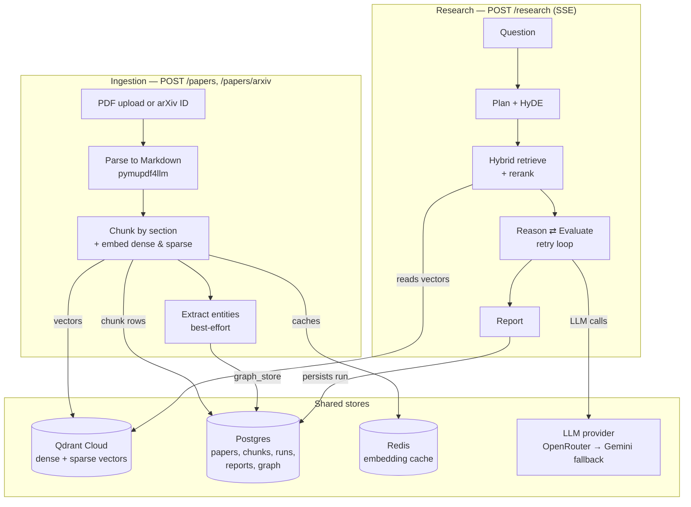

# Scholar

Scholar is an agentic RAG (Retrieval-Augmented Generation) system for academic papers: ingest PDFs or arXiv links, then ask research questions in a chat interface and get back a synthesized, cited answer backed by hybrid retrieval, multi-step reasoning, contradiction detection, and self-evaluation.

> **This is a learning project.** It was built to explore how the pieces of an agentic RAG system actually fit together — query decomposition, hybrid search, cited reasoning with retries, cross-answer contradiction checking, and a persisted audit trail — not to run as a production service. There's no auth, no multi-tenancy, and it assumes a single trusted user.

## What it does

Two flows, sharing the same stores:

1. **Ingest** a paper (PDF upload or arXiv ID) into a searchable, section-aware knowledge base.
2. **Ask** a question in the Chat page; Scholar decomposes it, retrieves relevant passages across your whole library, reasons over them with citations, checks for contradictions between sources, and writes a report — all streamed live and persisted so you can revisit it later on the History page.

## Architecture



## Project services

### API — FastAPI routers (`backend/routers/`)

| Router | Endpoints | Purpose |
|---|---|---|
| `health` | `GET /health` | Liveness check for Qdrant, Postgres, Redis |
| `papers` | `GET /papers`, `GET /papers/{id}`, `POST /papers`, `POST /papers/arxiv` | Upload/ingest papers, list the library |
| `query` | `POST /query` | Single-shot hybrid retrieval + reasoning (no decomposition) |
| `research` | `POST /research` | The full multi-agent pipeline, streamed as SSE |
| `runs` | `GET /runs`, `GET /runs/{trace_id}` | Browse and replay past research runs |

### Ingestion services (`backend/services/ingestion/`)

| Service | Responsibility |
|---|---|
| `pdf_fetcher_service` | Resolves an arXiv ID, fetches its metadata and PDF |
| `pdf_parser_service` | PDF → per-page Markdown (`pymupdf4llm`, headings detected from font size) |
| `section_chunker_service` | Splits Markdown into section-aware chunks; drops References/table noise; never breaks mid-equation |
| `embedding_service` | Dense embeddings (Sentence-Transformers) |
| `sparse_indexer_service` | Sparse BM25 embeddings (fastembed) |
| `entity_extraction_service` | Best-effort LLM entity/relation extraction for the knowledge graph |
| `orchestrator` | Wires the above into one pipeline: fetch → parse → chunk → embed → index → extract |

### Agent services (`backend/services/agents/`)

| Service | Responsibility |
|---|---|
| `planner_service` | Classifies and decomposes a question into sub-questions; writes HyDE passages |
| `retrieval_service` | Hybrid dense + sparse search (RRF-fused), then reranked |
| `reranker_service` | Cohere reranker if keyed, else a local cross-encoder, else no-op |
| `reasoning_service` | Answers a sub-question from retrieved chunks with `[CHUNK_N]` citations |
| `evaluation_service` | Scores faithfulness / relevance / context-precision; decides whether to retry |
| `contradiction_service` | Compares sub-answers for genuine factual conflicts |
| `report_writer_service` | Synthesizes one direct answer from all sub-answers, plus the structured report |

### Other backend services

| Service | Responsibility |
|---|---|
| `llm/llm_service` | OpenRouter if `OPENROUTER_API_KEY` is set, otherwise Gemini by default (same OpenAI-compatible client, different `base_url`); classifies rate-limit/connection errors so callers can degrade gracefully |
| `graph/knowledge_graph_service` | In-process NetworkX graph of extracted entities, persisted as one JSONB blob |
| `repositories/*` | Thin data-access layer: `postgres_repository`, `qdrant_repository`, `redis_repository`, `graph_repository` |

### Frontend (`frontend/`, Streamlit)

| Page | What it does |
|---|---|
| `app.py` | Landing page, backend health indicator |
| `1_Library.py` | Upload/ingest papers; table of your library with status, type, and a link back to the source |
| `2_Query.py` | Chat interface — live-streamed research runs, session history |
| `3_History.py` | Browse or look up any past run by trace ID; replays its full report |
| `common.py` | Shared SSE parsing and report-rendering used by both Query and History |

## The two pipelines, step by step

### Ingestion

1. **Fetch** — an uploaded PDF is read directly; an arXiv ID is resolved through arXiv's API, then downloaded. A `Paper` row is created with status `processing` before parsing starts.
2. **Parse to Markdown** — `pymupdf4llm` converts the PDF, rendering detected headings as `#`/`##`/...
3. **Chunk by section** — the chunker tags each chunk with a section label (Abstract, Methodology, Results, ...), drops the References section (including un-headed continuation pages) and table fragments, and splits long sections on sentence boundaries that never break a `$...$` math expression.
4. **Embed, twice** — each chunk gets a dense vector (cached in Redis by text hash) and a sparse BM25 vector. One UUID is generated per chunk and used as both the Qdrant point ID and the Postgres `Chunk.id`, so a citation can always be traced back to an exact passage.
5. **Index and extend the graph** — vectors upsert into Qdrant, chunk rows land in Postgres, and (best-effort, never blocking ingestion) a sample of chunks goes through entity extraction into the shared knowledge graph. The paper flips to `ready`.

### Research

1. **Classify & decompose** — a heuristic tags the question factual/analytical/comparative; the planner LLM breaks it into 3–6 atomic sub-questions and writes a HyDE passage for each to steer retrieval.
2. **Retrieve, per sub-question** — dense and sparse search run against Qdrant, fused by Reciprocal Rank Fusion, then reranked down to the final set.
3. **Reason, cite, evaluate — retry if unfaithful** — the strong-tier LLM answers from retrieved chunks only, citing `[CHUNK_N]`. Faithfulness/relevance/context-precision are scored; a low-faithfulness answer is regenerated (up to `RETRY_MAX_ATTEMPTS`) and the best attempt wins. One sub-question's failure is isolated and reported inline — it doesn't take the rest of the run down with it. Two or more rate-limit/connection failures in a run stop further LLM calls and surface a plain "network issues" message instead of repeating the same failure per sub-question.
4. **Check for contradictions** — a second LLM pass compares sub-answers for genuine factual conflicts, not just differing scope or emphasis.
5. **Synthesize the answer, write the report** — one direct paragraph answering the original question (with a deterministic extractive fallback if that call fails), plus per-sub-question findings, confidence scores, and a source list resolved to real paper titles and pages.

Every phase, sub-question, chunk, answer, score, and contradiction is persisted to Postgres as it happens, which is what makes the History page work — a run is fully replayable, not just live-streamed.

## Data stores

| Store | Holds |
|---|---|
| **Postgres** | `papers`, `chunks`, `research_runs`, `sub_questions`, `retrieved_chunks`, `sub_answers`, `contradictions`, `reports`, `audit_logs`, `graph_store` |
| **Qdrant Cloud** | Dense + sparse vectors, one point per chunk |
| **Redis** | Dense-embedding cache, keyed by text hash |

## Tech stack

FastAPI · SQLAlchemy (async) + asyncpg · Alembic · Qdrant Cloud · Redis · Sentence-Transformers · fastembed (BM25) · pymupdf4llm · OpenAI SDK (against OpenRouter or Gemini) · Cohere (optional reranker) · NetworkX · Streamlit · pytest

## Getting started

```bash
# 1. Install dependencies
uv sync --group dev --group test

# 2. Configure environment
cp .env.example .env
# fill in: Postgres/Redis (local via docker-compose, or your own),
# a Qdrant Cloud URL + API key, and either OPENROUTER_API_KEY or GEMINI_API_KEY

# 3. Start local Postgres + Redis (Qdrant runs on Qdrant Cloud, not locally)
docker compose up -d postgres redis

# 4. Apply migrations
uv run alembic upgrade head

# 5. Run the backend
uv run uvicorn backend.main:app --reload

# 6. Run the frontend (separate terminal)
uv run streamlit run frontend/app.py
```

Then open the Streamlit URL, ingest a paper on the Library page, and ask about it on the Query page.


## Known limitations

- No authentication — anyone who can reach the API can use it.
- The knowledge graph is wired into ingestion only; nothing in retrieval queries it yet.
- Free-tier LLM keys rate-limit quickly under real use — that's exactly what the network-issue handling in `llm_service.py` is there to degrade gracefully around, not eliminate.
